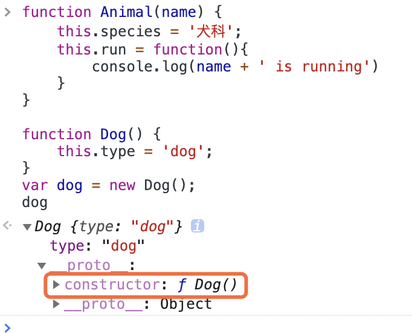
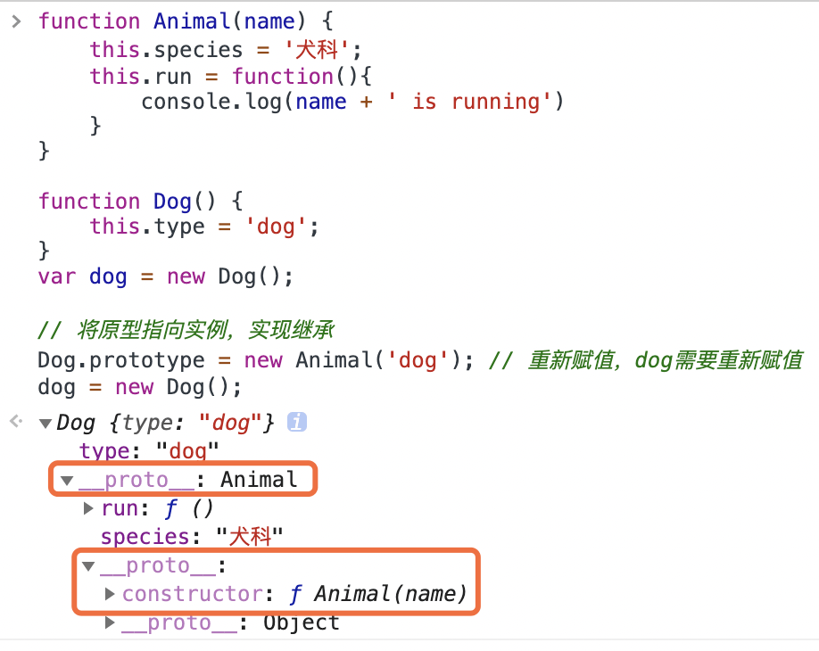
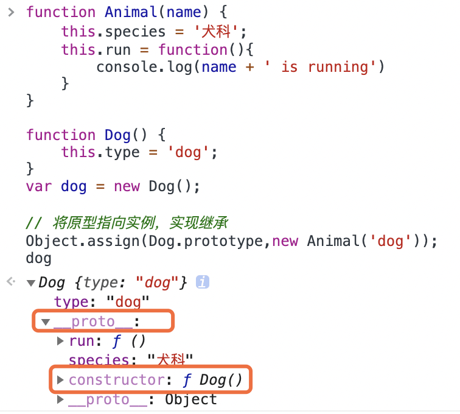

## 封装
> 隐藏对象内部属性和方法的实现，只对外暴露所需接口，使用时只需关注如何使用，无需了解内部实现；
> 优点：降低耦合

```js
function Animal(name) {
    this.species = '犬科';  // 实例属性
    this.run = function(){ // 实例方法
        console.log(name + ' is running')
    }
}
var cat = new Animal('cat');
console.log(cat.species); // '犬科'
cat.run(); // 'cat is running'
```

## 继承（基于原型链）

### 共享属性/方法
> 实例属性无法共享，共享属性只能通过prototype定义

```js
function Animal(name) {
    this.species = '犬科';  // 实例属性
    this.run = function(){ // 实例方法
        console.log(name + ' is running')
    }
}
var cat = new Animal('cat');
var dog = new Animal('dog');

// 修改实例属性
cat.species = '猫科';
console.log(dog.species); // '犬科', 不受cat影响
```

```js
function Animal(name) {
    this.run = function(){ // 实例方法
        console.log(name + ' is running')
    }
}
var cat = new Animal('cat');
var dog = new Animal('dog');

// 修改原型属性
Animal.prototype.species = '猫科';
console.log(cat.specied); // '猫科'
console.log(dog.specied); // '猫科'
```

### 继承
> 让一个对象拥有另一个对象的属性和方法
>
> 原型链继承：将对象`A`的原型，指向另一个对象`B`的实例；则对象`A`的所有实例都继承了对象`B`的所有属性/方法


```js
function Animal(name) {
    this.species = '犬科';
    this.run = function(){
        console.log(name + ' is running')
    }
}

function Dog() {
    this.type = 'dog';
}
var dog = new Dog();
console.log(dog);  // {type: 'dog'}

// 将原型指向实例，实现继承
Dog.prototype = new Animal('dog'); // 必须重新赋值，不然Animal修改，Dog无法继承。dog需要重新赋值
dog = new Dog();
console.log(dog); // {type: 'dog', __proto__: {species: '犬科', run:...}}
```

#### 不同赋值方式对比





#### 判断原型的方法
+ isPrototypeOf：测试一个对象是否存在于另一个对象的原型链上
```js
function Person(name) {
	this.age = 18;
	this.name = name;
}
function Children(name) {
	this.childName = name;
}
Children.prototype = new Person('xx')         // Children继承Person
var children = new Children('xxx')

Children.prototype.isPrototypeOf(children)    // true, children是Children的实例
Person.prototype.isPrototypeOf(children)      // true, children的__proto__指向Children的原型，也就是Person的实例
Person.prototype.isPrototypeOf(Children)      // false, Children是个函数
```
+ hasOwnProperty：测试一个对象的**自身**是否含有某个属性  （实例属性 + 静态属性，不包含原型属性）
```js
function Person(name) {
	this.age = 18;
	this.name = name;
}
Person.prototype.from = 'FuJing';
Person.prototype.intro = function() {
	console.log(this.name + ' is from ' + this.from + ', ' + this.age + ' years old')
}
Person.isMale = false;
var person1 = new Person('cly');

person1.hasOwnProperty('age')             // true
person1.hasOwnProperty('name')            // true
person1.hasOwnProperty('from')            // false，from为原型属性
person1.hasOwnProperty('intro')           // false，intro为原型方法

function Children(name) {
	this.childName = name;
}
Children.prototype = new Person('xx')         // Children继承Person
var children = new Children('xxx')

children.hasOwnProperty('age')            // false，age为继承属性
children.hasOwnProperty('childName')      // true

Person.hasOwnProperty('age')              // false
Person.hasOwnProperty('isMale')           // true
```

## 多态
> 多种属性，且存在优先级

### 属性/方法分为：
+ 实例属性/方法
+ 静态属性/方法：对象自身属性，实例无法使用
+ 原型属性/方法
+ 继承原型属性/方法

### 属性/方法名一致时，获取的优先级：
> 实例属性 => 原型属性 => 继承原型属性，一层一层往内查找，直到找到对应的属性为止

```js
function Animal(name) {
    this.species = '犬科';
    this.run = function(){
        console.log(name + ' is running')
    }
}

function Dog() {
    this.type = 'dog';
}
var dog = new Dog();

Dog.prototype.sound = 'ao!';
Animal.prototype.species = '猫科';
Dog.prototype = new Animal('dog'); // 必须重新赋值，不然Animal修改，Dog无法继承。dog需要重新赋值
dog = new Dog();

Animal.prototype.species = '猫科';

console.log(dog.type); // 'dog', 来自Dog实例属性
console.log(dog.sound); // undefined, Dog.prototype被覆盖
console.log(dog.species); // '犬科', 来自Dog继承自Aniaml的实例属性: dog.__proto__.species
console.log(dog.__proto__.__proto__.species); // '猫科', 来自Dog继承自Aniaml的原型属性
```
