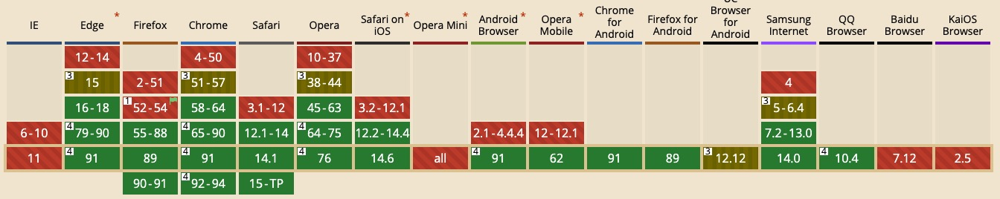

我们先来看这样一个例子:


上图的绿色方块不断滚动，顶部会提示它的可见性。

传统的实现方法是，监听到`scroll`事件后，调用目标元素（绿色方块）的`getBoundingClientRect()`方法，得到它对应于视口左上角的坐标，再判断是否在视口之内。
这种方法的缺点是，由于scroll事件密集发生，计算量很大，容易造成`性能问题`。

## 一、IntersectionObserver API
一个新的Web API诞生，用于观察目标元素与视口的交叉性。

我们来看一下`IntersectionObserver`的兼容性：


可以看到目前`IntersectionObserver`除了在`IE`下不支持外，其他主流浏览器基本都支持。

## 二、语法
用法比较简单，创建一个`IntersectionObserver`构造函数的实例，即可实现一个交叉监听器：
```js
var io = new IntersectionObserver(callback, option);
```

其中，参数中的`callback`回调函数是目标元素与视口达到一定交叉后执行的函数；`option`对应配置对象。

然后开始设置观察的目标对象，可设置多个。
```js
var element = document.getElementById('example')
// 开始观察
io.observe(element);
// 停止观察
io.unobserve(element);
// 关闭观察器
io.disconnect();
```

## 三、callback参数
目标元素与视口的交叉度变化时，就会调用观察器的回调函数`callback`

`callback`一般会触发两次：一次是目标元素刚刚进入视口（开始可见），另一次是完全离开视口（开始不可见）。

`callback`函数的参数（`entries`）是一个数组，每个成员都是一个`IntersectionObserverEntry`对象
```js
var io = new IntersectionObserver(entries => {
    console.log(entries);
});
```

## 四、IntersectionObserverEntry 对象
`IntersectionObserverEntry`对象描述了观察到的交叉度的变化：
```js
var io = new IntersectionObserver(entries => {
    entries.forEach(entry => {
        //   entry.isIntersecting => 交叉度在阈值范围内时
        //   entry.time => 交叉度在阈值范围内时的时间
        //   entry.rootBounds => 根元素的getBoundingClientRect()方法的返回值
        //   entry.target => 被观察的目标元素
        //   entry.boundingClientRect => 目标元素的getBoundingClientRect()方法的返回值
        //   entry.intersectionRatio => 交叉区域的比例，即intersectionRect占boundingClientRect的比例，完全可见时为1，完全不可见时小于等于0
        //   entry.intersectionRect => 交叉区域的信息
    })
});
```

## 五、options选项
```js
options = {
    root: document.querySelector('#scrollArea'), // 根元素
    rootMargin: '0px',  // 根元素的css margin值
    threshold: 1.0 // 目标元素与根元素的交叉区域定义
}
```

### threshold
当目标元素和根元素的交叉度达到该值时，执行`callback`。

默认值为`0`，表示目标元素在根元素出现`1px`立即执行`callback`。

通常是个`number数组`，特殊情况下可以简写为一个`number`。

示例：
    [0]，可简写为 0，表示目标元素在根元素出现`1px`立即执行`callback`，执行一次
    [0,1]，表示目标元素在根元素 出现`1px`以及退出前`1px` 立即执行`callback`，执行两次
    [0,0.25,0.5,0.75,1]，表示当目标元素 0%、25%、50%、75%、100% 可见时，都会触发回调函数


## 六、应用
无限瀑布流。

```vue
// IntersectionObserver组件
<template>
    <!--
        瀑布流辅助组件
        原理：放在页面最底部，监听元素的可视事件，当元素可见，触发@intersect
     -->
    <div class="observer" />
</template>

<script>
export default {
    name: 'Observer',

    props: {
        options: {
            type: Object,
            default: () => {},
        },
    },

    data() {
        return {
            observer: null,
        };
    },

    mounted() {
        this.init();
    },

    destroyed() {
        this.observer.disconnect();
    },

    methods: {
        init() {
            this.observer = new IntersectionObserver(([entry]) => {
                if (entry && entry.isIntersecting) {
                    this.$emit('intersect');
                }
            }, this.options);

            this.observer.observe(this.$el);
        },
    },
};
</script>

<style lang="scss">
.observer {
    height: 100px;
}
</style>
```

```vue
// 调用
<template>
    <div>
        // list
        <IntersectionObserver @intersect="loadMore" />
    </div>
</template>

<script>
export default {
    methods: {
        loadMore() {
            // 加载下一页
            // if (this.loading || this.isEnd) return;
            // if (this.query.page_num === 1 && !this.list.length) return;
            // this.query.page_num += 1;
        },
    }
}
</script>
```