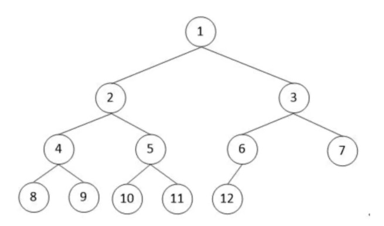
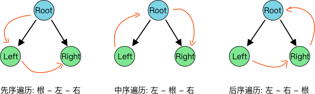

## 二叉树长啥样
+ 每个节点最多两个分支
+ 左子树 和 右子树



```js
const tree = {
    val: 1,
    left: {
        val: 2,
        left: {
            val: 4,
            left: {
                val: 8,
            },
            right: {
                val: 9,
            },
        },
        right: {
            val: 5,
            left: {
                val: 10,
            },
            right: {
                val: 11,
            },
        },
    },
    right: {
        val: 3,
        left: {
            val: 6,
            left: {
                val: 12,
            },
        },
        right: {
            val: 7,
        },
    },
};
```

## 二叉树遍历方式

### 深度遍历
> 先中后序是看的根节点在什么时机遍历


分为三种，见图：


+ 先序遍历: 先从根节点到左子树，直到所有的左子树都遍历完了，再遍历右子树
  + `1, 2, 4, 8`, `9`,  => `5, 10`, `11`,  => `3, 6, 12`, `7`

+ 中序遍历: 从最低部，先从左子树到根节点再到右子树。再从根节点算作左子树重复
  + `8, 4, 9`,  =>  `2`,  `10, 5, 11`,  => `1`,  => `12, 6`, => `3`, => `7`

+ 后序遍历: 从最低部，先从左子树到右子树再到根节点。再从根节点算作左子树重复
  + `8, 9, 4`,  => `10, 11, 5`,  => `2`,  => `12`,  => `6, 7, 3`, => `1`


### 广度遍历
> 每层从左至右依次遍历
+ 1, 2, 3, 4, 5, 6, 7, 8, 9, 10, 11, 12


## 二叉树遍历的实现 - 递归

### 先序遍历
```js
function DLR(root){
    const output = [];
    const loop = (node) => {
        if(!node) return;
        output.push(node.val);
        loop(node.left);
        loop(node.right);
    }
    loop(root);
    console.log(output);
}
DLR(tree); // [1, 2, 4, 8, 9, 5, 10, 11, 3, 6, 12, 7]
```

### 中序遍历
```js
function LDR(root){
    const output = [];
    const loop = (node) => {
        if(!node) return;
        loop(node.left);
        output.push(node.val);
        loop(node.right);
    }
    loop(root);
    console.log(output);
}
LDR(tree); // [8, 4, 9, 2, 10, 5, 11, 1, 12, 6, 3, 7]
```

### 后序遍历
```js
function LRD(root){
    const output = [];
    const loop = (node) => {
        if(!node) return;
        loop(node.left);
        loop(node.right);
        output.push(node.val);
    }
    loop(root);
    console.log(output);
}
LRD(tree); // [8, 9, 4, 10, 11, 5, 2, 12, 6, 7, 3, 1]
```

### 广度遍历
```js
function BLR(root){
    const output = [];
    const stack = [root];
    let count = 0;
    const loop = () => {
        const node = stack[count]
        if(!node) return;

        output.push(node.val);
        // 将左子树和右子树放到stack中，才能从上至下从左至右遍历
        if(node.left) stack.push(node.left);
        if(node.right) stack.push(node.right);
        count++;
        loop()
    }
    loop();
    console.log(output);
}
BLR(tree); // [1, 2, 3, 4, 5, 6, 7, 8, 9, 10, 11, 12]
```

## 二叉树遍历的实现 - 非递归

> 思路: 递归 = 栈 + 循环


### 递归等效于栈+循环
#### 递归：
1. 一定条件下调用自身
2. 调用自身
3. 每次调用自身的参数可能有所变化

#### 栈 + 循环：
1. 栈存储每次参数的变化
2. 循环使用while + 条件
3. 循环调用函数


#### 示例
```js
/**
 * 简单构造个栈结构
 */
class Stack {
    constructor() {
        this.stackArr = [];
    }
    push(val) {
        this.stackArr.push(val);
        return this.stackArr.length;
    }
    pop() {
        const popData = this.stackArr.pop();
        return popData;
    }
    get isEmpty() { // 是否为空
        return this.stackArr.length <= 0;
    }
}
```

```js
// 先序
function DLR(root) {
    const stack = [];
    const output = [];
    stack.push(root); // 从root出发
    while (!stack.isEmpty) {
        const pop = stack.pop();
        if (pop) {
            output.push(pop.val);
            // 先入后出，先序是从根到左到右，所以先push右子树
            if (pop.right) {
                stack.push(pop.right);
            }
            if (pop.left) {
                stack.push(pop.left);
            }
        }
    }
    return output;
}
DLR(tree); // [1, 2, 4, 8, 9, 5, 10, 11, 3, 6, 12, 7]
```

```js
// 中序
function LDR(root) {
    const output = [];
    const stack = new Stack();
    let node = root;
    while (!stack.isEmpty || node) {
        if (node) {
            stack.push(node);
            node = node.left;
        } else {
            const pop = stack.pop();
            output.push(pop.val);
            if (pop.right) {
                node = pop.right;
            }
        }
    }
    return output;
}
LDR(tree); // [ 8, 4, 9, 2, 10, 5, 11, 1, 12, 6, 3, 7 ]
```

```js
// 后序
function LRD(root) {
    const output = [];
    const stack = new Stack();
    stack.push(root);
    while(!stack.isEmpty) {
        const pop = stack.pop();
        if (pop) {
            // 后序是左->右->根，如果从头插入，则是根->右->左
            output.unshift(pop.val);
            if (pop.left) {
                stack.push(pop.left)
            }
            if (pop.right) { // 后入先出
                stack.push(pop.right)
            }
        }
    }
    return output;
}
LRD(tree); // [ 8, 9, 4, 10, 11, 5, 2, 12, 6, 7, 3, 1 ]
```

```js
function BLR(root) {
    const queue = [];
    const output = [];
    queue.push(root);
    while (queue.length > 0) {
        const pop = queue.pop();
        if (pop) {
            output.push(pop.val);
        if (pop.left) {
            queue.unshift(pop.left);
        }
        if (pop.right) {
            queue.unshift(pop.right);
        }
        }
    }
    return output;
}
BLR(root); // [ 1, 2, 3, 4, 5, 6, 7, 8, 9, 10, 11, 12 ]
```


## 递归与循环方式的性能对比
```js
// 先序
console.time('DLR1')
DLR1(tree);
console.timeEnd('DLR1')
// DLR1: 0.343017578125 ms

console.time('DLR2')
DLR2(tree);
console.timeEnd('DLR2')
// DLR2: 0.18896484375 ms


// 中序
console.time('LDR1')
LDR1(tree);
console.timeEnd('LDR1')
// LDR1: 0.411865234375 ms

console.time('LDR2')
LDR2(tree);
console.timeEnd('LDR2')
// LDR2: 0.111083984375 ms


// 后序
console.time('LRD1')
LRD1(tree);
console.timeEnd('LRD1')
// LRD1: 0.432861328125 ms

console.time('LRD2')
LRD2(tree);
console.timeEnd('LRD2')
// LRD2: 0.294921875 ms


// 广度
console.time('BLR1')
BLR1(tree);
console.timeEnd('BLR1')
// BLR1: 0.447998046875 ms

console.time('BLR2')
BLR2(tree);
console.timeEnd('BLR2')
// BLR2: 0.0888671875 ms
```