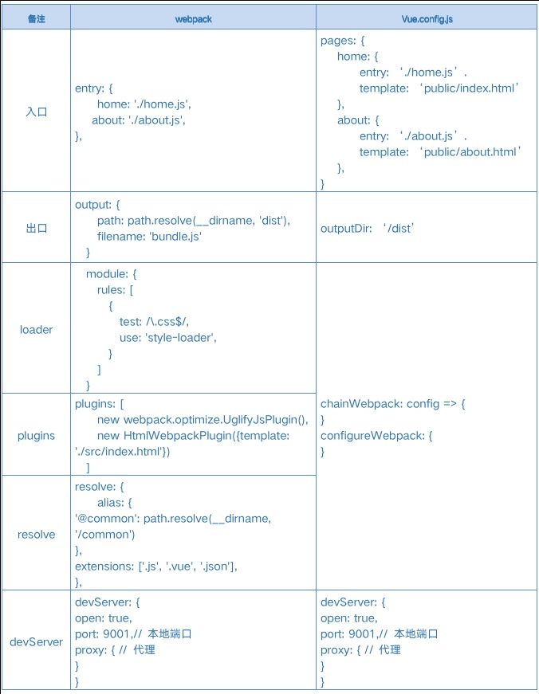

## 一. webpack搭建项目需要做哪些？

### 1. 初始package.json
```shell
mkdir test-webpack
cd test-webpack
npm init -y
```

### 2. 各种安装
#### webpack, webpack-cli webpack-dev-server
```shell
npm install webpack webpack-cli webpack-dev-server -S
```

#### 插件
+ 安装`html-webpack-plugin`是用于扩展webpack的功能
+ 安装`clean-webpack-plugin`插件用于清除目录内容

```shell
npm install html-webpack-plugin clean-webpack-plugin -S
```

#### loader
+ css
+ js, babel
+ file
+ vue

```shell
npm install sass-loader node-sass css-loader file-loader babel-loader vue-loader vue-template-compiler -S
```

#### babel
```shell
npm install @babel/core @babel/cli @babel/preset-env  @babel/plugin-transform-arrow-functions  @babel/runtime @babel/plugin-transform-runtime -S
```

#### vue
```shell
npm install vue vuex vue-router -D
```

### 3. 项目文件布局
```
| - public
  | - index.html
| - src
  | - App.vue
  | - main.js
| - package.json
| - webpack.config.js
| - babel.config.js
| - .eslintrc
```

### 4. 各种设置
+ entry 入口
+ output 出口
+ resolve.alias 别名
+ module.rule loader
+ plugins 插件
+ devServer webpack-dev-server

### 5. 不同环境分别处理一个webpack

```js
// webpack.config.js
const path = require('path');
const HtmlWebpackPlugin = require('html-webpack-plugin');
const { CleanWebpackPlugin } = require('clean-webpack-plugin');
const VueLoaderPlugin = require('vue-loader/lib/plugin');

module.exports = {
    entry:{
        app:'./src/main.js' //需要打包的文件
    },
    output: {
        filename: 'bundle.js',//输入的文件名是什么，dist里面生成的文件名也是什么
        path: path.resolve(__dirname, 'dist')//指定生成的文件目录
    },
    resolve: {
        alias: {
            '@': resolve('./'),
            '@constants': resolve('./js/constants.js'),
            '@axios': resolve('./services/fetch.js'),
        },
    },
    module: {
        rules: [
            {
                test: /\.css$/,
                use: [
                    'vue-style-loader',
                    'style-loader',
                    'css-loader'
                ]
            },
            {
                test: /\.(jpg|png|svg|gif)$/,
                use: [
                    'file-loader'
                ]
            },
            {
                test: /\.(woff|woff2|eot|ttf|otf)$/,
                use: [
                    'file-loader'
                ]
            },
            {
                test: /\.js$/,
                use: [
                    'babel-loader'
                ],
                exclude: /node_modules/
            },
            {
                test: /\.vue$/,
                use: [
                    'vue-loader'
                ],
            },
            {
                test:/\.scss$/,
                use:[
                    'style-loader',
                    'css-loader',
                    'sass-loader'
                ]
            },
        ]
    },
    plugins: [
        new HtmlWebpackPlugin({
            template:'./public/index.html',//这个文件放到dist的文件一样
        }),
        new CleanWebpackPlugin(),
        new VueLoaderPlugin()
    ],
    devServer: {
        contentBase: './dist',
        port: 8080
    },
}
```

## 二、为什么要使用vue-cli?
### 1. webpack缺点
    每个项目写的都一样，每次都写一遍，配置也是“又长又臭”，可能还要做各种定义，性能优化等等，花费太多时间

### 2. 循环“约定大于配置”原则
    ”能不配置的就不配置，也不纠结这么配置好与不好，快速进入业务开发才是正经事"

### 3. cli指令与service服务抽离
    `CLI`: 即`vue`全局命令，主要用于项目创建和管理，包含了`vue create`、`vue ui`(可视化管理项目)这些命令

    `Service`层: 负责项目的实际构建，也就是webpack项目构建

### 4. 配置可见可修改

#### 查看默认配置
+ `vue inspect`指令查看生效的`webpack`配置
+ `@vue/cli-service/lib/config`查看默认配置

#### 修改配置
+ `vue.config.js`


## 三、vue inspect的使用
```shell
// 导出 webpack 配置信息到指定文件
vue inspect > xxx.js

// 输出 指定环境 的配置信息 mode：production、test、development
vue inspect --mode <mode>

// 查看所有已配置规则名称列表
vue inspect --rules
输出为：
[
    'vue',
    'images',
    'svg',
    'media',
    'fonts',
    'pug',
    'css',
    'postcss',
    'scss',
    'sass',
    'less',
    'stylus',
    'js'
]

// 查看指定规则 ruleName： 上述数组选项
vue inspect --rule <ruleName>

// 查看所有已配置插件列表
vue inspect --plugins

// 查看指定插件配置
vue inspect --plugin <pluginName>

// 显示完整webpack配置
vue inspect -v
vue inspect --verbose

// 显示帮助信息
vue inspect -h
vue inspect --help

// 其他配置...
vue inspect entry > xxx.js
vue inspect output > xxx.js
vue inspect resolve > xxx.js
```

## 四、vue.config.js与webpack配置对比




## 五、webpack-chain链式写法生成webpack配置
webpack配置的链式写法，可以实现webpack原来所有的配置

### 1. 常用

```js
const path = require('path');
function resolve (dir) {
    return path.join(__dirname, dir)
}
```

#### 1. entry入口文件
+ 清空clear()
+ 新增add()

```js
chainWebpack: config => {
  config.entryPoints.clear(); // 会把默认的入口清空
  config.entry('main').add('./src/main.js'); //新增入口
  config.entry('index').add('./src/index.js'); //新增入口
}

// 等同于以下 webpack 配置
entry: {
  main: [
    './src/main.js'
  ],
  index: [
      './src/index.js'
  ]
}
```

#### 2. output输出配置
+ 修改默认配置output.xxx()

```js
chainWebpack: config => {
   config.output
        .path(resolve('./dist'))
        .filename('[name].[chunkhash].js')
        .chunkFilename('chunks/[name].[chunkhash].js')
        .libraryTarget('umd');
}

// 等同于以下 webpack 配置
output: {
  path: path.resolve(__dirname, './dist'),
  filename: '[name].[chunkhash].js',
  chunkFilename: 'chunks/[name].[chunkhash].js',
  libraryTarget: 'umd'
},
```

#### 3. alias设置别名
+ resolve.alias.set(xxx, xxx)

```js
chainWebpack: (config)=>{
    config.resolve.alias
        .set('@assets',resolve('src/assets'))
        .set('@components',resolve('src/components'))
        // .delete('base') // 删掉指定的别名
        // .clear()  会把所有别名都删掉
}

// 等同于以下 webpack 配置
resolve: {
  alias: {
    '@assets': resolve('src/assets'),
    '@components': resolve('src/components')
  }
},
```

#### 4. loader
+ 新增rule(xxx).use(xxx).loader(xxx)
+ 修改配置rule(xxx).use(xxx).tap()
+ 移除clear()
+ 替换：先移除后添加

```js
// 新增
chainWebpack: (config)=>{
    config.module
        .rule('babel') // 配置名称
        .test(/\.(js|jsx|mjs|ts|tsx)$/) // 后缀
        .include
            .add(path.resolve(__dirname,  'src'))
            .end()
        .use('babel-loader') // loader名
        .loader('babel-loader') // loader名
        .options({ // options
            'presets':['@babel/preset-env']
        })
}

// 等同于以下 webpack 配置
module: {
  rules: [
    {
      test: /\.(js|jsx|mjs|ts|tsx)$/,
      include: [
        path.resolve(__dirname,  'src')
      ],
      use: [
        {
          loader: 'babel-loader',
          options: {
              presets: [
                '@babel/preset-env'
              ]
            }
        }
      ]
    }
  ]
}

// 修改
chainWebpack: (config)=>{
    config.module
        .rule('babel')
        .use('babel-loader')
        .tap(options => {
            // 修改它的选项...
            options = options || {};
            options.include = path.resolve(__dirname,  'test');
            return options; // 必须返回一个newoptions
        })
}

// 移除
chainWebpack: config => {
    config.module.rules.clear(); // 添加的loader都删掉.
    config.module.rule('babel').uses.clear();  // 删除指定loader
}

// 替换
chainWebpack: config => {
    const svgRule = config.module.rule('svg') // 获取loader

    // 清除loader。
    // 如果不这样做，接下来的 loader 会附加在该规则现有的 loader 之后。
    svgRule.uses.clear()

    // 添加要替换的 loader
    svgRule
      .use('vue-svg-loader')
        .loader('vue-svg-loader')
}
```

#### 5. plugins插件
+ 新增plugin(xxx).use(xxx)
+ 修改配置rule(xxx).use(xxx).tap()
+ 移除delete()
+ 重置插件配置init()
+ 在xxx插件之前/后调用xxx插件 before()/after()

```js
chainWebpack: config => {
    config.plugin('HtmlWebpackPlugin') // 定义plugin名
        .use(HtmlWebpackPlugin, [ // plugin及optiions
        {
            template: path.resolve(__dirname, './src/index.html'),
            minify: {
            collapseWhitespace: true,
            minifyJS: true,
            minifyCSS: true,
            removeComments: true,
            removeEmptyAttributes: true,
            removeRedundantAttributes: true,
            useShortDoctype: true
            }
        }
    ]);
}

// 等同于以下 webpack 配置
plugins: [
    new HtmlWebpackPlugin({
        template: path.resolve(__dirname, './src/index.html'),
        minify: {
            collapseWhitespace: true,
            minifyJS: true,
            minifyCSS: true,
            removeComments: true,
            removeEmptyAttributes: true,
            removeRedundantAttributes: true,
            useShortDoctype: true
        }
    })
],

// 修改
chainWebpack: config => {
    config.plugin('html') // plugin名
        .tap((args) => [{ // 必须返回一个数组
            ...(args[0] || {}),
            template: path.resolve(__dirname, './main.html'),
        }]);
}

// 移除
chainWebpack: config => {
    config.plugins.delete('prefetch')
    // 移除 preload 插件
    config.plugins.delete('preload');
}

// 重置
chainWebpack: config => {
    config.plugin('html')
        .init((Plugin, args) => new Plugin(...args));
}

// 在xxx插件之前/后调用xxx插件
chainWebpack: config => {
    config.plugin('html-template')
        .use(HtmlWebpackTemplate)
        .end()
        .plugin('script-ext')
        .use(ScriptExtWebpackPlugin)
        .before('html-template');
}
chainWebpack: config => {
    config.plugin('html-template')
        .after('script-ext')
        .use(HtmlWebpackTemplate)
        .end()
        .plugin('script-ext')
        .use(ScriptExtWebpackPlugin);
}
```

#### 6. optimization一些优化 - 代码分割、压缩
```js
// 代码分割
chainWebpack: config => {
    config.optimization.splitChunks({
        chunks: "async", // 必须三选一： "initial" | "all"(推荐) | "async" (默认就是async)
        minSize: 30000, // 最小尺寸，30000
        minChunks: 1, // 最小 chunk ，默认1
        maxAsyncRequests: 5, // 最大异步请求数， 默认5
        maxInitialRequests : 3, // 最大初始化请求书，默认3
        automaticNameDelimiter: '~',// 打包分隔符
        name: function(){}, // 打包后的名称，此选项可接收 function
        cacheGroups:{ // 这里开始设置缓存的 chunks
            priority: 0, // 缓存组优先级
            vendor: { // key 为entry中定义的 入口名称
                chunks: "initial", // 必须三选一： "initial" | "all" | "async"(默认就是async)
                test: /react|lodash/, // 正则规则验证，如果符合就提取 chunk
                name: "vendor", // 要缓存的 分隔出来的 chunk 名称
                minSize: 30000,
                minChunks: 1,
                enforce: true,
                maxAsyncRequests: 5, // 最大异步请求数， 默认1
                maxInitialRequests : 3, // 最大初始化请求书，默认1
                reuseExistingChunk: true // 可设置是否重用该chunk
            }
        }
    });
}

// 压缩
chainWebpack: config => {
    config.optimization.minimizer('css')
        .use(OptimizeCSSAssetsPlugin, [{ cssProcessorOptions: { safe: true } }]) // 新增

    config.optimization.minimizer('css')
        .tap(args => [...args, { cssProcessorOptions: { safe: false } }]) // 修改
}
```

#### 7. devServer - 代理，hot, open, openPage
```js
chainWebpack: config => {
    config.devServer.port(8888)
      .open(true)
      .proxy({'/dev': {
                 target: 'http://123.57.153.106:8080/',
                 changeOrigin: true,
                 pathRewrite: {
                   '^/dev': ''
                 }
               }
           })
}
```

#### 8. 条件配置when
```js
chainWebpack: config => {
    // 1、示例：仅在生产期间添加minify插件
    config.when(process.env.NODE_ENV === 'production', config => {
        config.plugin('minify')
            .use(BabiliWebpackPlugin);
    });

    // 2、示例：只有在生产过程中添加缩小插件，否则设置 devtool 到源映射
    config.when(process.env.NODE_ENV === 'production',
        config => config.plugin('minify').use(BabiliWebpackPlugin),
        config => config.devtool('source-map')
    );
}
```

## 六、其他一些问题

### 1. polyfill兼容
    vue-cli项目预置了`@vue/babel-preset-app`，若有一些不支持的`ES5`语法，可以手动设置`polyfills`，如果有`ES6+`特性语法，再加上`useBuiltIns: 'entry'`设置，然后在入口文件添加 `import 'core-js/stable'; import 'regenerator-runtime/runtime';`
```js
// babel.config.js
module.exports = {
    presets: [
        ['@vue/app', {
            polyfills: [
                'es7.object.entries',
                'es6.promise',
            ],
            useBuiltIns: 'entry',
        }],
    ],
};
```