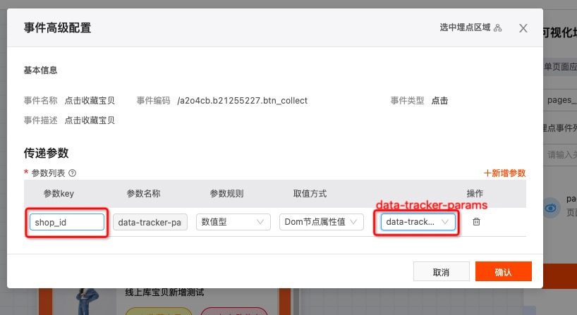
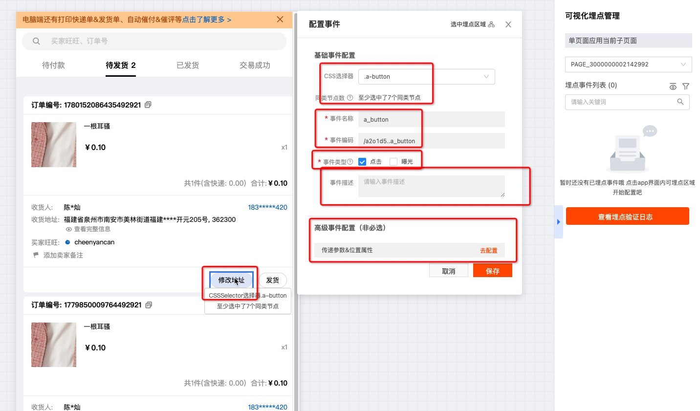
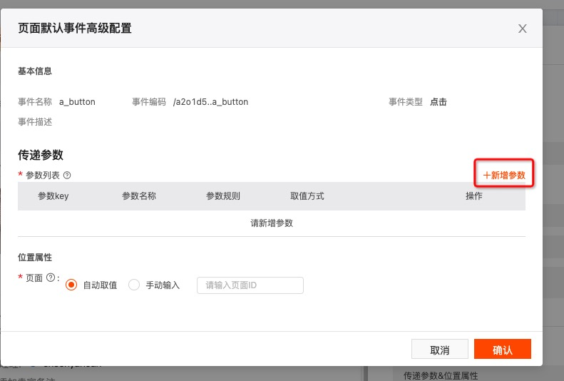
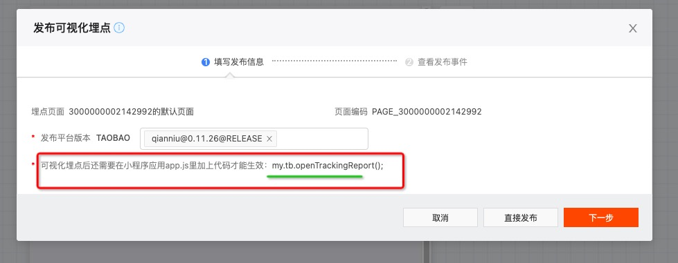
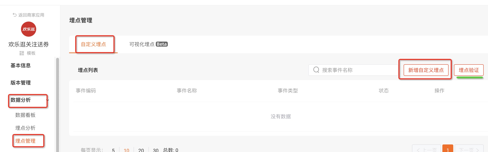
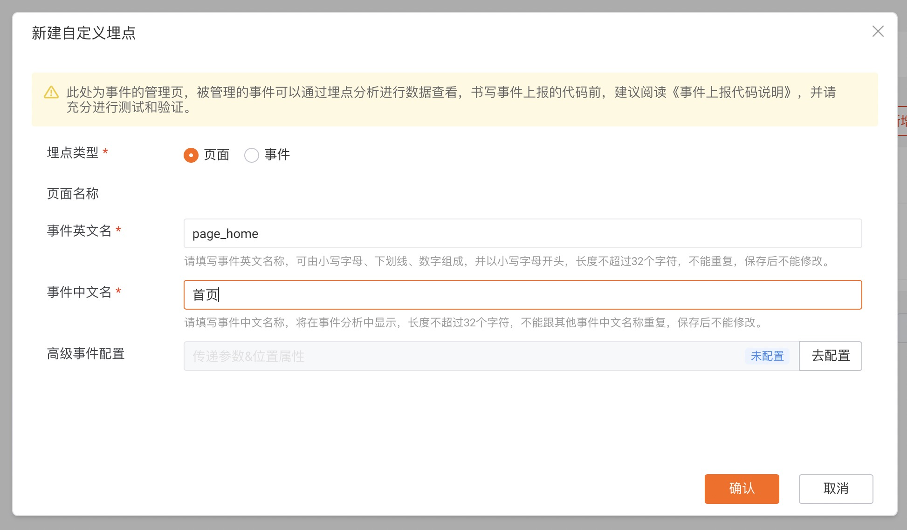
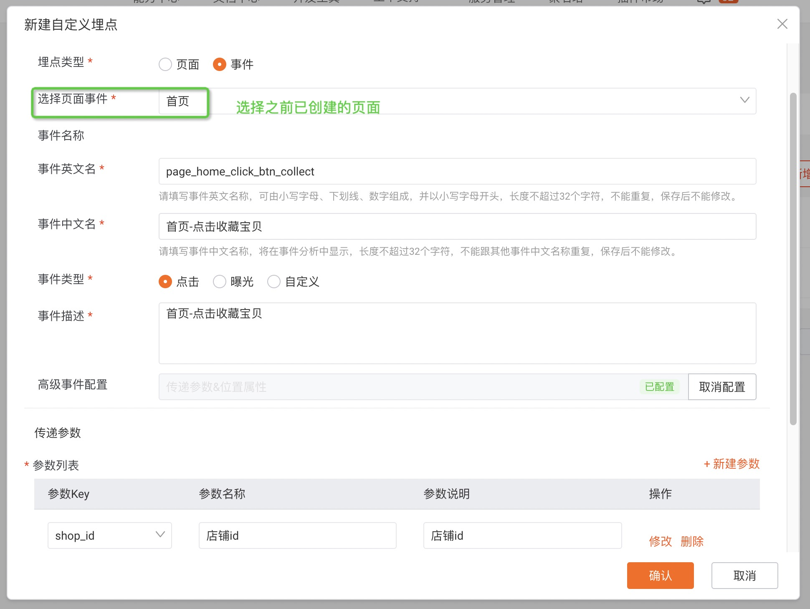
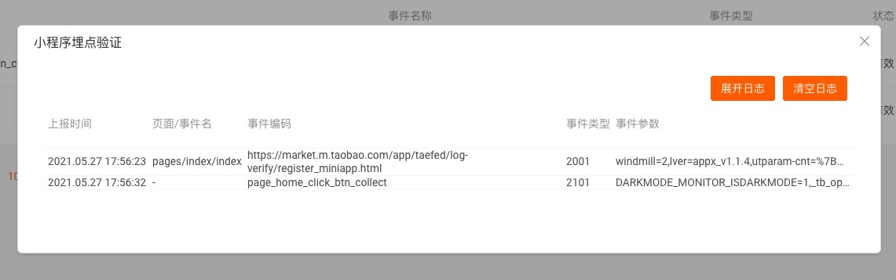

> 淘宝小程序已内置埋点sdk，不需要再额外引入插件或sdk

淘宝小程序埋点方式有两种：
1. 可视化埋点
2. 代码埋点


## 一、可视化埋点

### 1. 代码上处理
**接口:**
在入口文件app.js上添加代码：my.tb.openTrackingReport();

**参数:**
针对页面和指定元素，参数可设置的值不同：
+ 页面：目前只支持静态值
+ 指定元素：
  + 静态值
  + 动态值：需要在页面上先设置好参数，具体操作

#### 设置参数步骤
> data-tracker-params: 值为一个json字符串
+ 可视化埋点中设置对应的参数
    + 通过新增参数，并且设置成“Dom节点中获取”，采集脚本就会在这个组件内的“data-tracker-params”属性里获取到参数值并上报了
      
+ 指定页面上设置参数
```html
<div data-tracker="12345">
    元素
    <span></span>
    <span></span>
    <span></span>
</div>
<div>
    <span data-tracker="67890" data-tracker-params="{/'key1/':/'value1/'}">
        
    </span>
    <span data-tracker="67890"></span>
    <span data-tracker="67890"></span>
</div>
```

### 2. 页面上投屏埋点
#### 入口：
找到对应小程序应用，路径：数据分析 → 埋点管理 → 可视化埋点 → 进入可视化编辑


#### 投屏：
> 投屏链接可以是本地环境链接，也可以是线上环境链接。默认是当前线上环境链接
   1. 填写链接生成二维码，扫描进入，<font color="red">一切正常情况下</font>，页面会投屏手机上的页面，并且可以可视化添加埋点。
   2. 点击其中一个需要埋点的按钮，出现「配置事件」弹窗
      1. 目前淘宝使用的是「CSS选择器」绑定元素，一般的埋点操作都是埋在有意义的按钮上，类名也是有意义的，选择唯一类名就可以
      2. 其他配置：
         1. 事件名称：英文，page_页面名_事件类型_元素类型_元素含义
            1. 事件类型包含:  click(点击)、expose(曝光)、其他自定义...
            2. 元素类型，比如按钮btn、图片img之类
            3. 元素含义，比如收藏宝贝collect，加入购物车addcart之类
         2. 事件编码（使用淘宝生成的就好）
         3. 其他看着填
      3. 添加参数，见上面参数设置「2. 可视化埋点中设置对应的参数」
      
      

> <font color="red">不正常情况: </font>
>
> 只要是在页面上使用过“代码埋点（reportAnalytics）”的，都无法投屏（「千牛小程序-欢乐逛打折」亲测）
>
> 点击出“应用聊天窗口”后，再进入“无代码埋点”页面，才可以正常投屏


#### 发布
点击发布，选择版本，出现提示：
<font color="red">可视化埋点后还需要在小程序应用app.js里加上代码才能生效：my.tb.openTrackingReport();</font>



### 3.埋点验证与分析
#### 一、本地验证
手机投屏地址，输入本地IDE的预览二维码的地址，进入投屏
「查看埋点验证日志」—— 实时更新埋点数据

#### 二、预发/线上验证
埋点发布到指定版本后，指定版本操作
「数据分析 - 埋点分析」，可以看到预发以及线上的数据


## 二、代码埋点
### 1.页面上创建自定义埋点
#### 入口：
数据分析 → 埋点管理 → 自定义埋点 → 新增自定义埋点


#### 创建埋点：
自定义埋点分为「页面」和「事件」两类，「事件」类埋点必须在「页面」的基础上，所以在创建一个页面的埋点之前，必须先创建「页面埋点」

<font color="red">事件英文名书写规则：</font>
+ 页面：page_页面名
+ 事件：page_页面名_事件类型_元素类型_元素含义
+ 事件类型包含:  click(点击)、expose(曝光)、其他自定义...
+ 元素类型，比如按钮btn、图片img之类
+ 元素含义，比如收藏宝贝collect，加入购物车addcart之类




#### 保存埋点：
点击<font color="red">「确认」</font>自动保存并更新埋点列表


### 2.页面代码上处理
API文档，见: [my.reportAnalytics自定义分析数据的上报接口](https://miniapp.open.taobao.com/docV3.htm?docId=907&docType=20&source=search)

使用<font color="red"> my.reportAnalytics </font>上报埋点

以上面创建的两个埋点(一个页面埋点不需要处理，要处理的是事件埋点)为例：

```js
// CLICK_COLLECT埋点: 在点击「收藏宝贝」按钮的事件上添加如下代码
// 埋点事件名（必填），支持的枚举值：enter、exposure、click、other
my.reportAnalytics('click', {
    // 页面名称埋点，（可选，如此项不填，小程序容器会自动取currentPagePath）
    pageName: 'page_home',
    logkey: 'page_home_click_btn_collect',
    shop_id: this.shop.shop_id,
})
```


### 3.埋点验证与分析
#### 一、本地验证
输入本地IDE的预览二维码的地址，生成验证二维码，扫描
「点击查看详情」—— 手机上操作，页面实时更新埋点数据，如图


#### 二、预发/线上验证
直接预发/上线一个版本
「数据分析 - 埋点分析」，可以看到预发以及线上的数据


