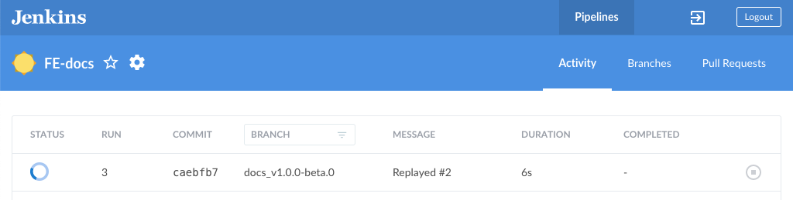

## 1. 入口查看
+ `package.json` > `scripts`, 提供各种指令

## 2. 接入jenkins

### 2-1. 创建 Jenkins 任务
打开 [自己搭建的jenkins平台地址](https://jenkins.gaoding.com)，点击左侧栏的 `Open Blue Ocean`：


点击 `New Pipeline`


选择 `GitHub Enterprise` ，接着选择对应的组织和仓库


最后点击 `Create Pipeline`


### 2-2. 项目创建Jenkinsfile文件

#### 2-2-1. 一般流程
添加`Jenkinsfile`文件后，将代码提交到 `Github`，提交成功后会在 [jenkins blue平台](https://jenkins.gaoding.com/blue/pipelines) 找到对应刚才创建的项目


进入项目可看到一条任务正在构建


稍等几分钟可看到构建成功，控制台也输出了打印日志


#### 2-2-2. 指定分支触发CI/CD
上面配置完，默认所有分支进行 `git push`、`pull request` 都会触发 `CI/CD` ，但往往我们只需要`特定的分支`做 `CI/CD`，如 `dev`, `fat`。只需要做一些配置即可。 在对应的项目下点击 `configure`


在 `Branch Sources` 下点击 `Add` 选择 `Filter by name (with regular expression)`


接着在 `Regular expression` 输入框输入`正则表达式`匹配需要触发构建的`分支名`，最后点击 `Save` 即可配置完成，注意一般 `master` 不做构建
```js
^(dev|fat|stage)(-v\d{1,9})?$|^(dev|fat)-daily-(\d{1,9})?$|^(stage|prod)-v\d{1,3}(\.\d{1,3}){0,2}$
```


#### 2-2-3. 指定tag触发CI
对于项目的`上线流程`我们约定通过 `master` 分支打个 `prod tag` 的方式触发 `CI`，对应的需要在 `Jenkins` 做以下配置。

在 `Branch Sources` Add `Discover tag （发现tag）`


在 `Branch Sources` 下的 `Build strategies` 添加 `Change requests`、`Named branches`、`Tags`


对 `Named branches` 设置 `Regular expression`


`Regular expression` 跟上面的` Branch Sources` 设置一样
```js
^(dev|fat|stage)(-v\d{1,9})?$|^(dev|fat)-daily-(\d{1,9})?$|^(stage|prod)-v\d{1,3}(\.\d{1,3}){0,2}$
```

然后将 `Tags` 下的 `Ignore tags older than` 设置为 `1`

最后点击 `Save` 保存提交即可


#### 2-2-4. 配置Jenkinsfile文件，连接apollo,cdn,lint等
> 通过`Jenkinsfile`里执行`package.json` > `scripts`里的指令

示例`Jenkinsfile`：
```js
env.DIND_PROJECT_LABEL_DEDICATED = "frontend"
// env.DIND_CI_CD_POD_TEMPLATE_NAME = env.DIND_CI_CD_FRONTEND_POD_TEMPLATE_NAME;
env.DIND_CI_CACHE_ENABLED = true;
env.DIND_CI_CACHE_KEY_ENV_KEY="GIT_BRANCH";
env.DIND_CI_CACHE_PATHS="node_modules/,dist/,yarn.lock";
env.DINGTALK_ACCESS_TOKEN = "95cc4518624add1dc9193ffe9521cdc1f97fa476027845f9c5160a2f48c8c16a";
env.DINGTALK_MOBILES = "18506951407";

pipelineDefault.run({
    stage('Test') {
        if (env.GIT_BRANCH =~ /^(dev|master|release|release_(.*))$/)  {
            sh '''
                yarn
                yarn lint
            '''
        } else {
            currentBuild.result = 'SUCCESS'
            return
        }
    }

    stage('Build') {
        if (env.GIT_BRANCH =~ /^(dev|master|release|release_(.*))$/)  {
            sh '''
                yarn build
                yarn release
                yarn sync-cdn
                yarn apollo
                yarn release-apollo
                yarn notice
            '''
        } else {
            currentBuild.result = 'SUCCESS'
            return
        }
    }
})

```

`package.json` > `scripts`:
```js
"scripts": {
    "lint": "eslint --report-unused-disable-directives .", // eslint
    "build": "ci-task-runner", // 构建
    "release": "node build_scripts/release.js",  // 一些release构建文件
    "sync-cdn": "node build_scripts/sync-cdn.js", // 同步到cdn
    "apollo": "node build_scripts/apollo.js", // apollo取静态入口文件
    "release-apollo": "node build_scripts/release-apollo.js", // apollo发布
    "notice": "node build_scripts/notice.js", // 钉钉群通知
},
```

